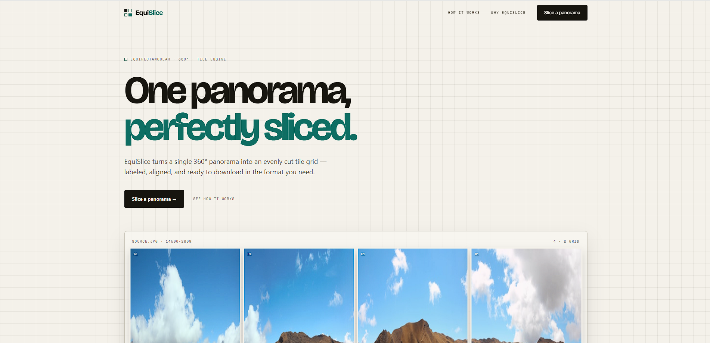
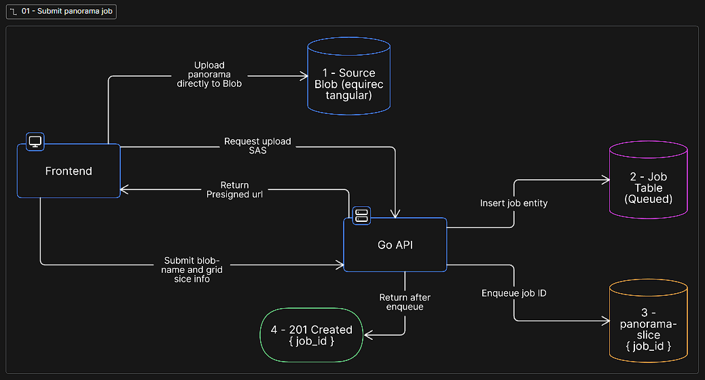
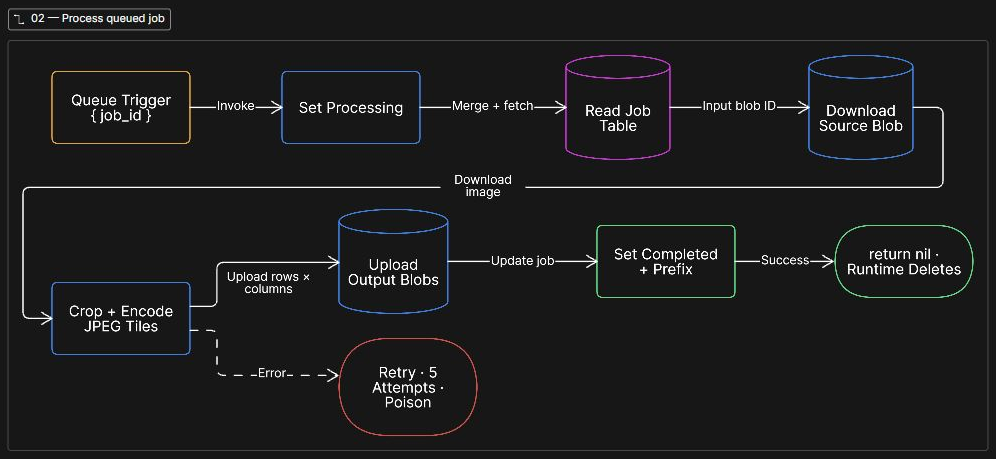
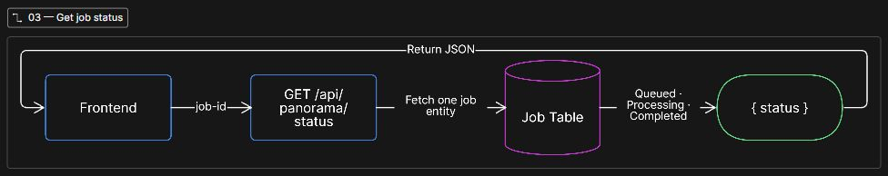
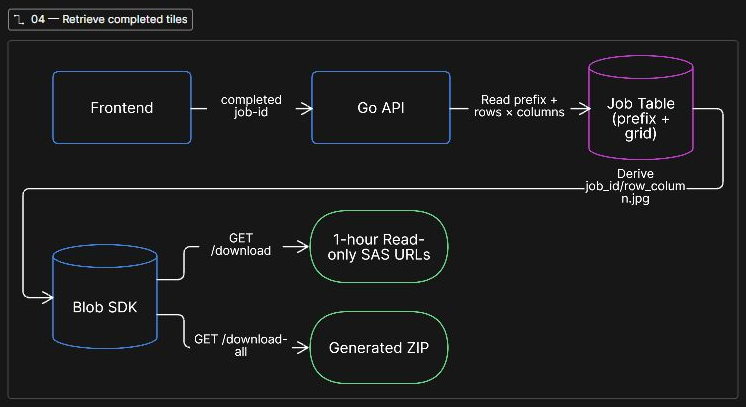
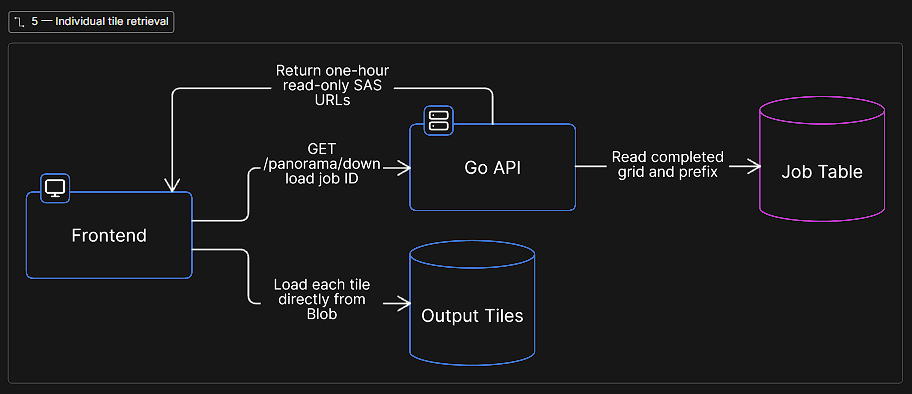
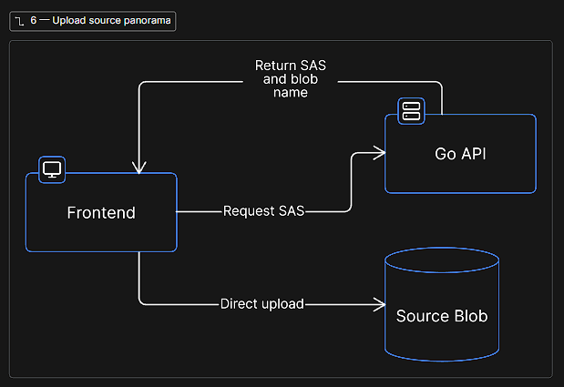

# EquiSlice

EquiSlice turns an equirectangular panorama into an evenly sized grid of JPEG tiles. The browser asks the Go API for a short-lived, write-only Azure Blob SAS URL, uploads the image directly to Blob Storage, then submits the uploaded blob name as a slicing job. The API records and queues that job, and an Azure Queue-triggered Function generates the tiles.



## Project layout

| Directory | Purpose |
| --- | --- |
| `frontend/` | React + Vite cutter experience |
| `backend/` | Go HTTP API and Azure Blob, Queue, and Table Storage integration |
| `azure-functions/` | Go Azure Function that consumes panorama slice jobs |
| `terraform/` | Azure infrastructure configuration |

## Architecture flows

### 1. Submit a panorama job



The upload is deliberately split into two API calls: `POST /api/panorama/upload` returns a blob-specific upload SAS URL and blob name; the browser uploads the image directly to that URL; then `POST /api/panorama/slice` creates the job from the blob name and grid settings. The Go API never proxies the panorama bytes.

### 2. Process the queued job



### 3. Check job status



### 4. Retrieve completed tiles



### 5. Individual tile retrieval



### 6. Upload source panorama



The frontend calls the local backend directly at `http://localhost:3000/api`; there is no development proxy.

## Prerequisites

- Node.js 20+
- Go 1.26.3+
- An Azure Storage account connection string, or Azurite for local Function development
- Azure Functions Core Tools if running the Function locally

## Local setup

### 1. Configure the backend

Create `backend/.env` with your Azure Storage connection string and local frontend origin:

```dotenv
AZURE_CONNECTION_STRING=<Azure Storage connection string>
FRONTEND_URL=http://localhost:5173
```

Never commit this file or a real connection string.

### 2. Start the backend

```powershell
Set-Location backend
go run ./cmd
```

The API listens on `http://localhost:3000`.

### 3. Start the frontend

In another terminal:

```powershell
Set-Location frontend
npm install
npm run dev
```

Open `http://localhost:5173/cutter`.

The cutter saves the most recent panorama job UUID in browser `localStorage`. Reloading or restarting the browser resumes status polling for that job. A newly created job replaces the stored UUID.

## API

| Method | Endpoint | Description |
| --- | --- | --- |
| `GET` | `/api/health` | Health check |
| `POST` | `/api/panorama/upload` | Returns a short-lived, write-only Blob SAS URL and generated source blob name for a JPG or PNG upload |
| `POST` | `/api/panorama/slice` | Creates a panorama slicing job from JSON: `file` (the uploaded blob name), `rows`, `columns`, and `file_formats` |
| `GET` | `/api/panorama/status?job-id=<uuid>` | Returns the job status |
| `GET` | `/api/panorama/download?job-id=<uuid>` | Returns download URLs when processing is complete |
| `GET` | `/api/panorama/download-all?job-id=<uuid>` | Downloads all completed tiles as one ZIP archive |

## Azure Function

The Function in `azure-functions/` listens to the `panorama-slice` queue and uses:

- `AzureWebJobsStorage` for the queue-trigger binding
- `EQUISLICE_STORAGE_CONNECTION_STRING` for Blob and Table Storage access

For a cloud-backed local test, configure both variables with the same Azure Storage connection string. For an entirely local Function setup, start Azurite and use the local values in `azure-functions/local.settings.json`.

```powershell
Set-Location azure-functions
func start
```

The Go Function worker uses `FUNCTIONS_WORKER_RUNTIME=native` locally. The deployed Flex Consumption app uses its runtime configuration (`go`, version `1.0`) rather than that local setting.

## Validation commands

```powershell
Set-Location frontend
npm test
npm run build
npm run lint
```

## Security note

Storage account keys and connection strings grant broad storage access. Keep them in local environment files or Azure app settings, not in source control. If a key is ever exposed, rotate it and update the backend and Function App configuration together.
